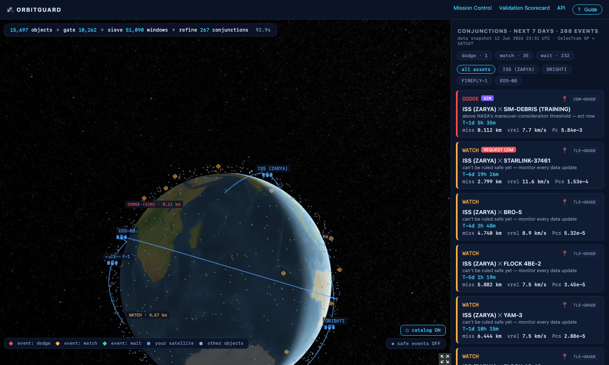
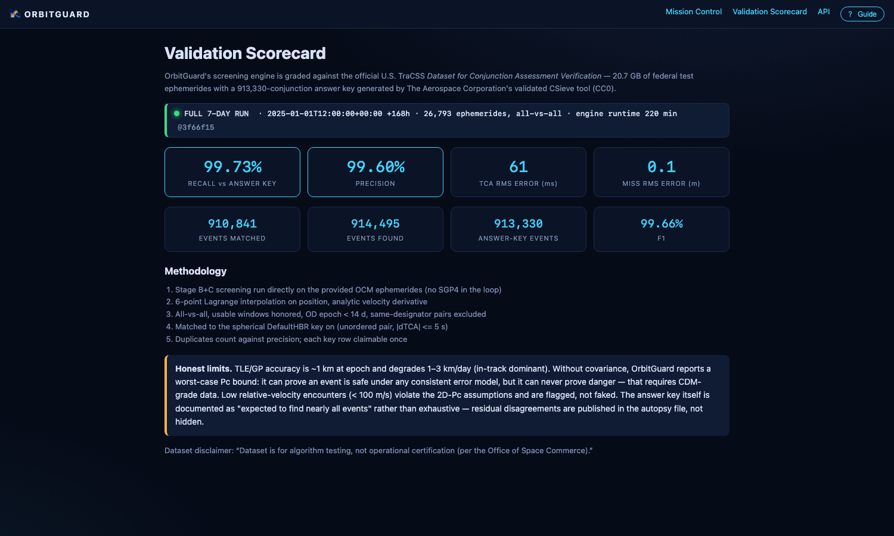
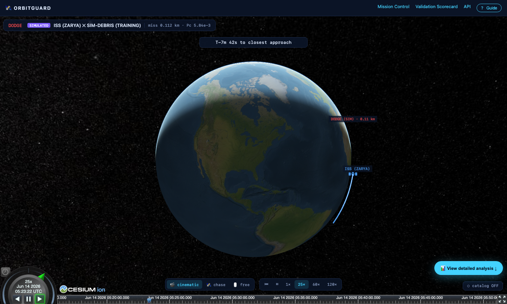
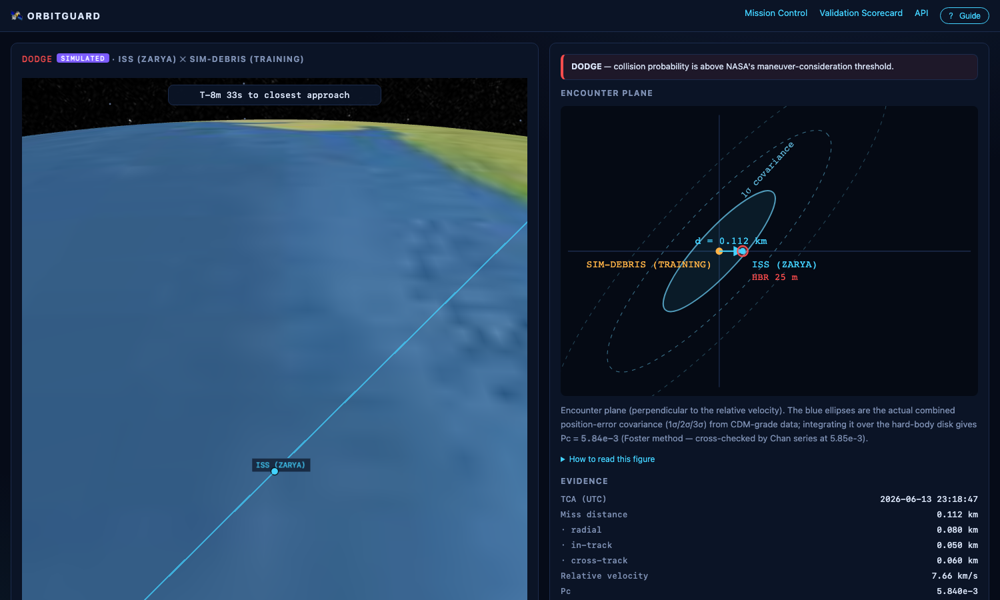

<div align="center">

# OrbitGuard

### Satellite collision-risk screening with NASA-grade math, graded against a U.S. federal answer key

[](https://github.com/Nishant7p/OrbitGuard/actions)


Free, explainable, **validated** conjunction assessment for the satellite operators that commercial space-traffic services price out.

**[Live app](https://orbit-guard-six.vercel.app)** &nbsp;·&nbsp; **[Watch the demo](https://www.youtube.com/watch?v=QgZVFgDO7-E)** &nbsp;·&nbsp; **[Technical report](OrbitGuard_Technical_Report.pdf)**

</div>

---

## Contents

- [What it does](#what-it-does)
- [The problem](#the-problem)
- [How it works](#how-it-works)
- [Headline result: the federal exam](#headline-result-the-federal-exam)
- [The product](#the-product)
- [Feature highlights](#feature-highlights)
- [Why you can trust it](#why-you-can-trust-it)
- [Architecture](#architecture)
- [Tech stack](#tech-stack)
- [Quickstart](#quickstart)
- [Configuration](#configuration)
- [Repository map](#repository-map)
- [Honest limits](#honest-limits)
- [References](#references)
- [License](#license)

---

## What it does

OrbitGuard answers one question for a satellite operator: do I need to move my spacecraft, and can I trust the number that says so. It screens your satellites against the full public catalog of 15,000+ tracked objects, computes the probability of collision with the operational method NASA's CARA team runs, and shows every step as evidence you can read. It runs on 100% public data, in a browser, in about 90 seconds.



## The problem

Low-Earth orbit is crowded. More than 11,000 active satellites share the shells below 2,000 km with tens of thousands of tracked debris objects. Every operator, including university cubesat teams and small commercial constellations, receives conjunction warnings: cryptic data messages with a roughly 99% false-alarm rate. The real question is simple.

> Do I need to move my satellite, and can I trust the number that says so?

The tools that answer it cost tens of thousands of dollars per year (LeoLabs, COMSPOC), which for many small operators is more than the satellite itself. The free alternatives are tables without explanations, or globe visualizations without validated math. Nothing in the open answers the question with evidence.

## How it works

OrbitGuard is a complete conjunction-assessment system in four parts.

1. **Find every close approach.** A three-stage screening engine (a geometric gate, then a padded coarse-grid sieve that is mathematically guaranteed to miss nothing, then millisecond-precision refinement) sweeps your satellites against the full 15,000+ object catalog in seconds on a laptop.
2. **Compute risk with the operational method.** Collision probability via Foster 1992 encounter-plane quadrature, the method class NASA CARA runs, cross-checked by an independent analytic series on every result.
3. **Never bluff.** Public TLE orbits carry no uncertainty model, so OrbitGuard computes the worst-case probability over every error model consistent with the geometry. A bound can prove an event safe, it can never order a maneuver. When it cannot clear an event, the verdict escalates to requesting better data. TLE data can prove safety, never danger.
4. **Explain everything.** Each DODGE, WAIT, or WATCH verdict ships with its full numeric evidence record and a plain-language narration from a strictly grounded language model. The model cannot introduce a single number of its own. A digit-level validator enforces this, with a deterministic fallback that needs no API key.

## Headline result: the federal exam

The U.S. Office of Space Commerce publishes a verification dataset for conjunction-assessment systems: 20.7 GB of CCSDS-OCM ephemerides with a 913,330-conjunction answer key generated by The Aerospace Corporation's validated CSieve tool. OrbitGuard's engine ran the full 7-day, 26,793-object, all-vs-all configuration on an 8 GB laptop.

| Metric | Result |
|---|---|
| Recall | **99.73%** (910,837 of 913,330 key events found) |
| Precision | **99.60%** |
| TCA agreement | 61 ms RMS (matching tolerance is ±5 s) |
| Miss-distance agreement | 0.14 m RMS |

Residual mismatches are published, not hidden ([autopsies](data/scorecard_autopsy.json)). The methodology lives in [docs/VALIDATION.md](docs/VALIDATION.md), and the scorecard renders live in the app. Full technical deep-dive: [OrbitGuard_Technical_Report.pdf](OrbitGuard_Technical_Report.pdf).



## The product

**Mission Control.** Your satellites (blue, with orbit lines) flying through the real tracked catalog, risk-ranked verdict cards with countdowns, the screening funnel with timings, verdict filters, and hover-to-identify plus click-to-follow on every object.

**Encounter simulation.** A full-screen cinematic replay of each close approach. The camera frames both objects and zooms as they converge, a tether line recolors with live separation, and playback controls scrub around the moment of closest approach.



**Analysis view.** The encounter-plane figure (a covariance ellipse for CDM-grade data, worst-case circles for TLE-grade), the complete evidence record with a raw-JSON toggle, and the grounded explanation.



## Feature highlights

| Feature | What it does |
|---|---|
| Cinematic dual-tracking camera | Chase and free modes, comet-style glow trails, live separation telemetry, a TCA pulse, and 1 to 120x playback |
| Interactive guided UI | First-visit walkthrough, hover explanations on every number, click-to-locate from event cards, and layer toggles for catalog and low-risk events |
| Strict visual language | Blue icon is your satellite, grey dot is any other object, a red, amber, or green diamond is an event (a place and a time, which is why it does not move) |
| Physical hard-body radii | Per object pair from SATCAT radar-cross-section data, with provenance shown in the evidence, for example "RCS LARGE (5.0 m) + SATCAT type DEB (0.5 m)" |
| Narrate-only AI contract | The model receives a finished evidence record, a validator rejects any output whose digits are not traceable to it, and templates guarantee output without any API key |
| Typed REST API | FastAPI with an OpenAPI contract, serving the same records the UI renders |
| Offline-first | Committed fixtures and bundled imagery, so a dead network cannot kill a demo |

## Why you can trust it

These referees run in CI on every commit.

| Claim | Independent referee |
|---|---|
| The sieve misses nothing | A brute-force 1 s search over every pair, scored for recall and precision, on scenes with planted conjunctions, near-misses, and GEO/Molniya decoys |
| Foster Pc is exact | Closed-form noncentral-χ² (isotropic) to 1e-6 relative, an independent adaptive 2D quadrature to machine precision, and a 2M-sample Monte Carlo |
| PcMax is a theorem | A σ-sweep over four decades: exact Pc never exceeds R²/(e·d²), with the bound attained at σ = d/√2 |
| Frames are right | Skyfield's independent TEME to GCRS pipeline agrees to under 5 m |
| Scoring is honest | Synthetic ephemerides with closed-form answers, and duplicates penalize precision |

53 tests pass, backed by 43 engine referees.

## Architecture

```
CelesTrak GP (OMM JSON) ─┐
SATCAT (RCS sizes) ──────┤─▶ ingest ─▶ astro (vectorized SGP4 · TEME frames) ─▶ screening (A/B/C)
TraCSS OCM ephemerides ──┘                                                          │
                                  validation harness ◀──────────────────────────────┤
                                  (answer-key scoring)                              ▼
                                                       risk: Foster · Chan · PcMax · policy
                                                                    │
                                                                    ▼  evidence records (JSON)
                                          FastAPI ──▶ Next.js + CesiumJS UI
                                             │              ▲
                                             ▼              │ static bake (serverless deploys)
                                  explain (LLM, narrate-only + digit validator + template fallback)
```

The rule that keeps it honest: every number is computed in the Python data plane. The language model narrates one finished JSON record. It cannot change a verdict, a probability, or a distance.

## Tech stack

| Layer | Technology |
|---|---|
| Physics engine | Python 3.11+, NumPy, SciPy, python-sgp4 (vectorized C++ core), Skyfield |
| Screening at scale | numpy run-length window bookkeeping, cKDTree pairing, memory-bounded time slices (7-day all-vs-all in 8 GB RAM) |
| API | FastAPI, Pydantic (typed OpenAPI contract) |
| Frontend | Next.js 14, TypeScript, CesiumJS (3D globe), satellite.js (client-side propagation) |
| AI narration | Groq, llama-3.3-70b-versatile under a narrate-only contract |
| Data sources | CelesTrak GP and SATCAT, the U.S. TraCSS verification dataset (CC0), Space-Track CDMs (planned) |
| CI and deploy | GitHub Actions (engine tests and web build), Vercel (static deploy) |

## Quickstart

Prerequisites: Python 3.11 or newer, Node.js 20 or newer, and git.

**1. Clone and install the engine.**

```bash
git clone https://github.com/Nishant7p/OrbitGuard.git
cd OrbitGuard
python3 -m venv .venv
source .venv/bin/activate
pip install -e ".[dev]"
```

**2. Run the tests (optional, confirms the math referees pass).**

```bash
pytest                 # 53 tests
```

**3. Fetch public catalog data and run a screening.**

```bash
orbitguard fetch                                   # one cached CelesTrak download (2 h cache)
orbitguard screen --assets 25544 --days 7 --explain
```

The CLI can also be called as `python -m engine.cli ...` if you prefer.

**4. Start the API and the web app, in two terminals.**

```bash
uvicorn engine.api.app:app --port 8000             # terminal 1
```

```bash
cd web && npm install && npm run dev               # terminal 2, serves http://localhost:3000
```

Open http://localhost:3000.

**Deploy a shareable link with zero backend.**

```bash
orbitguard bake        # freezes the physics output into web/public/data/
```

Then import the repo on Vercel with Root Directory set to `web` and deploy. Static mode enables automatically.

## Configuration

Copy `.env.example` to `.env`. Everything works without any keys.

| Variable | Purpose |
|---|---|
| `GROQ_API_KEY` | Optional. Enables llama-3.3-70b narration of evidence records. Without it, the deterministic template renderer is used. |
| `SPACETRACK_USER`, `SPACETRACK_PASSWORD` | Optional. Public CDM ingest (stretch goal). |
| `ORBITGUARD_ASSETS` | Default demo NORAD IDs. Defaults to ISS, Pixxel FIREFLY-1, GalaxEye DRISHTI, and ISRO EOS-08. |
| `NEXT_PUBLIC_API_URL` | Frontend to API base URL. Defaults to http://localhost:8000. |

## Repository map

```
engine/ingest      CelesTrak GP and SATCAT fetchers, cache discipline enforced in code
engine/astro       OMM to SGP4, vectorized propagation, the single audited frames module
engine/screening   Stage A gate, Stage B padded sieve, Stage C Brent TCA, funnel telemetry
engine/risk        Foster, Chan, PcMax, encounter plane, verdict policy, evidence records
engine/explain     Narrate-only LLM client, digit validator, deterministic templates
engine/validation  OCM parser, all-vs-all harness, answer-key matcher, scorecard
engine/api         FastAPI with a typed OpenAPI contract
web/               Next.js 14 and CesiumJS: mission control, encounter inspector, scorecard
tests/             The verification core, 53 tests, three independent math referees
docs/              ALGORITHMS.md (the math), VALIDATION.md (methodology), and screenshots
```

## Honest limits

- GP/TLE accuracy is about 1 km at epoch, degrading 1 to 3 km per day. This is exactly why TLE-grade verdicts are worst-case bounds with an escalation path, never maneuver orders.
- Low relative-velocity encounters (under 100 m/s) violate the 2D-Pc assumptions. OrbitGuard flags them rather than printing a wrong number.
- The purple-badged SIMULATED event is a training scenario (simulated geometry plus CDM-grade covariance) that exercises the maneuver-alert path through the real probability pipeline.
- OrbitGuard is research-grade, not an operational service. The TraCSS dataset is a diagnostic, not a certification.

## References

Foster and Estes 1992 (NASA JSC-25898), Chan 1997 and 2008, NASA CARA 2D-Pc recommendations (NTRS 20190028900), NASA CA Handbook v2 2023 (NTRS 20230002470), Alarcon-Rodriguez et al. ESA SP-486 (2002), Hoots et al. 1984, Vallado et al. 2006, Auman et al. AMOS 2025, Office of Space Commerce Dataset for Conjunction Assessment Verification (CC0), and CelesTrak documentation. Full list: [docs/ALGORITHMS.md](docs/ALGORITHMS.md).

## Built for FAR AWAY 2026

OrbitGuard was built for the FAR AWAY 2026 Space and Aerospace Track. Software only, zero budget, public data.

## License

MIT, see [LICENSE](LICENSE). Built on free, public data, for the operators commercial space-traffic services leave behind.
